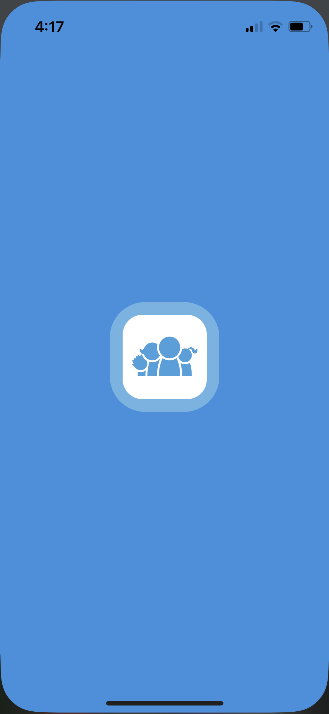

# **Assignment 1: Heuristic Evaluation**
Eric Chen | DH110 | Spring 2023

## **About the Project:**
This quarter, DH110 students are challenged to design a mobile app to help family members connect with one another. The connections enabled by the app should span at least 3 generations. I aim to design a **shared family journal** to solve this challenge. For more information on my project, check out the `README.md` file at the root of this DH110 repository. For this assignment, I will be evaluating two other apps which seek to enhance family connection. I will learn their strengths and weaknesses, thereby informing the development of my own project. The framework that will be used for evaluation is described below.
 

## **Nielson's 10 Usability Heuristics:**
Usability consultant and human-computer interaction researcher Jakob Nielsen developed a **usability framework** composed of 10 heuristics. These general rules can be used to evaluate how effective, efficient, and enjoyable it is to use a software or technology. Here are his 10 heuristics:

| Number | Heuristic | Do | Don't
|---|---|---|---|
| 1 | Visibility of System Status | communicate state of the system to the user frequently and openly | take actions without informing the user |
| 2 | Match Between System and Real World | use common terminology, follow real-world conventions | use unintuitive jargon |
| 3 | User Control and Freedom | allow users to back out of actions by providing clearly labeled cancel buttons | trap users into actions they took by mistake |
| 4 | Consistency and Standards | adapt industry conventions to make your product similar to others like it | stray from the user's expectation |
| 5 | Error Prevention | prevent errors using warnings and effective default options | allow important decisions without user confirmation |
| 6 | Recognition Rather Than Recall | make information readily visible to reduce memory load | force users to memorize information |
| 7 | Flexibility and Efficiency of Use | allow various methods to complete actions with personalization for individual users | provide only one way to do each action |
| 8 | Aesthetic and Minimalist Design | tailor content and design to focus on a few essential elements | include irrelevant information, make the interface hard on the eyes |
| 9 | Help Users Recognize, Diagnose, and Recover From Errors | report errors in plain language, suggest solutions, use visual cues to highlight errors | use error codes or technical jargon |
| 10 | Help and Documentation | provide concise and concrete documentation as needed | overburden the user with confusing documentation |

Now we will examine two apps in detail using these heuristics as our framework!  
 

# **App 1: FamilyWall [(website link)](https://www.familywall.com/en/index.html)**

  
  

*FamilyWall* is an app that seeks to connect families by providing them with acccess to shared to-do lists, calendars, photo albums, and recipe books, while also enabling location tracking and private messaging within the family group. They also offer "premium" features including budgeting and a meal planner. Above, you can see the main dashboard screen of the app, which I downloaded on my iPhone for testing. The top menu which reads "Chen" indicates which "circle" (family group) I am currently a part of.

### **Heuristic 1: Visibility of System Status**
Screenshots  
Severity 1-3
### **Heuristic 1: Visibility of System Status**
### **Top 3 Proposed Changes**

# **App 2: Chatbooks**
Overview & Thoughts  
URL
### **Heuristic 1: Visibility of System Status**
Screenshots  
Severity 1-3
### **Heuristic 1: Visibility of System Status**
### **Top 3 Proposed Changes**

## **References:**
Credit given to Emily Dong for markdown syntax reference
