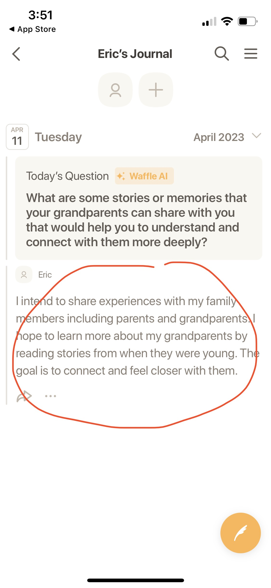

# **Assignment 1: Heuristic Evaluation**
Eric Chen | DH110 | Spring 2023

## **About the Project:**
This quarter, DH110 students are challenged to design a mobile app to help family members connect with one another. The connections enabled by the app should span at least 3 generations. I aim to design a **shared family journal** to solve this challenge. For more information on my project, check out the `README.md` file at the root of this DH110 repository. For this assignment, I will be evaluating two other apps which seek to enhance family connection. I will learn their strengths and weaknesses, thereby informing the development of my own project. The framework that will be used for evaluation is described below.
 

## **Nielson's 10 Usability Heuristics:**
Usability consultant and human-computer interaction researcher Jakob Nielsen developed a **usability framework** composed of 10 heuristics. These general rules can be used to evaluate how effective, efficient, and enjoyable it is to use a software or technology. Here are his 10 heuristics:

| Number | Heuristic | Do | Don't
|---|---|---|---|
| 1 | Visibility of System Status | communicate state of the system to the user frequently and openly | take actions without informing the user |
| 2 | Match Between System and Real World | use common terminology, follow real-world conventions | use unintuitive jargon |
| 3 | User Control and Freedom | allow users to back out of actions by providing clearly labeled cancel buttons | trap users into actions they took by mistake |
| 4 | Consistency and Standards | adapt industry conventions to make your product similar to others like it | stray from the user's expectation |
| 5 | Error Prevention | prevent errors using warnings and effective default options | allow important decisions without user confirmation |
| 6 | Recognition Rather Than Recall | make information readily visible to reduce memory load | force users to memorize information |
| 7 | Flexibility and Efficiency of Use | allow various methods to complete actions with personalization for individual users | provide only one way to do each action |
| 8 | Aesthetic and Minimalist Design | tailor content and design to focus on a few essential elements | include irrelevant information, make the interface hard on the eyes |
| 9 | Help Users Recognize, Diagnose, and Recover From Errors | report errors in plain language, suggest solutions, use visual cues to highlight errors | use error codes or technical jargon |
| 10 | Help and Documentation | provide concise and concrete documentation as needed | overburden the user with confusing documentation |

Now we will examine two apps in detail using these heuristics as our framework!  
 

# **App 1: FamilyWall [(website link)](https://www.familywall.com/en/index.html)**

## **First Look:**

  
  

FamilyWall is an app that seeks to connect families by providing them with acccess to shared to-do lists, calendars, photo albums, and recipe books, while also enabling location tracking and private messaging within the family group. They also offer "premium" services including budgeting and a meal planner. 

Above, you can see the two main pages of the app (which I downloaded on my iPhone for testing).
- The left image shows the *homescreen* which contains icons for the various family services (calendar, to-do list, etc). You can think of it like the iPhone homescreen which contains apps. The top menu that says "Chen" indicates which *circle* I am currently a part of. A circle is like a family group.  
- The right image shows the *explore* page, which is a comprehensive list of all available tools within the app. You can add or remove these from your *homescreen*.  

My first impression of the app is that it is generally well designed and aesthetically appealing. However, I can already foresee some usability issues. For example, the *homescreen* and *explore* page seems redundant to me. Let's dive into an in-depth evaluation of each criterion.

## **Heuristic Evaluation:**
### 1. Visibility of System Status
In my testing I immediately discovered a visibility issue. The *homescreen* is designed to allow users to access their frequently used services efficiently. They can pin or unpin services from their *homescreen*. However, the user can also unpin services from the *homescreen* by interacting with the icons on the *explore* page. When they do so, the only visual change that occurs is a small plus sign that appears next to the icon for the service which was removed. So when users unpin services in this way, it isn't clear how their action affected the state of the homepage.  

  The user unpins the <em>Lists</em> service from the <em>homescreen</em> via the <em>explore</em> page:

  

 

  Tiny plus sign is not sufficient communication to communicate the effect of the user's action:

  

 

  User has to navigate to <em>homescreen</em> to see the effect of their action (<em>Lists</em> is gone):

  

Furthermore, once the user navigates back to the *homescreen*, their unpinned services are nowhere to be seen. In order to see the services they unpinned, the user needs to navigate back to the *explore* page again, which is unintuitive.  

These issues are clear violations of heuristic 1, since the state of pinned and unpinned services is nearly invisible to the user.  

This doesn't make the app unusable but it is certainly more than a cosmetic issue. The main 2 pages of the app could definitely be redesigned to improve transparency and visual communication.  

`Severity Rating: 3`  
### 2. Match Between System and Real World
My main critique within this heuristic is the use of the word *circle* to refer to family groups. It is not immediately clear what this word means. This might not be a huge issue, except that users are confronted with this term with no explanation when they start the app for the first time. This is the screen users are presented with when they start:

  

This issue could be resolved by using a different term like "family group," or by providing a concise explanation of what a *circle* is when the user first starts the app.  

`Severity Rating: 1`  
### 3. User Control & Freedom
I didn't find any issues with user control and freedom. Here are a few strong points I noticed with regard to this heuristic:

  Each service has the <em>homescreen</em> icon at the top left to easily exit at any time:

  

 

  The <em>Panic Alert</em> feature has a prominent cancel button:

  

`Severity Rating: N/A`  
### 4. Consistency & Standards
This app exhibits good internal consistency, with terminology and actions remaining constant within the app.  

However, this app's external consistency is questionable. As the user, the look and feel of the *homescreen* and *explore* page remind me strongly of the iPhone homescreen, and the various family services are just like iOS apps. This analogy establishes the need for external consistency, since users will expect to be able to interact with these interfaces the same way that they interact with their iPhone homescreen. However, the consistency is not always there. For example, the *explore* page looks just like the iPhone homescreen, while the actual *homescreen* trades iOS style icons for wider icons. This makes it unclear which screen is meant to function as the user's home. Furthermore, the iPhone-esque look makes me instinctively try to swipe to switch between the two screens, but swiping isn't supported.  

  Would you expect to find these icons on a <em>homescreen</em>?

  

 

  In FamilyWall, those icons reside elsewhere, while these long rectangular icons populate the homescreen instead:

  

While users can probably get used to these inconsistencies as they use the app, usability could be greatly improved by enabling iOS-style homescreen interactions wherever visual similarities to iOS exist.

`Severity Rating: 2`  
### 5. Error Prevention
FamilyWall performed well on this heuristic. One good example of error prevention that I found was the warning that is provided when the user tries to log out of their account:

  Helpful warning when user attempts to log out:

  

`Severity Rating: N/A`  
### 6. Recognition Rather than Recall
The awkward design of the *homescreen* and *explore* page (discussed in heuristic 1) affects this heuristic as well. In order to add a new service to the *homescreen*, the user has to navigate away to the *explore* page and find the service by memory. The memory load on the user could be decreased by adding an "add new service" button on the *homescreen*, which would display the list of available services. This way, users could recognize the service options in context rather than having to remember them and go find them on a separate page.  

`Severity Rating: 1`  
### 7. Flexibility and Efficiency of Use
Once again, the *homescreen* and *explore* page structure is relevant to this heuristic. The purpose of the *homescreen* was presumably to provide flexbility and efficiency, allowing users to access their most frequently used services quickly. This didn't work effectively. Here are a couple of issues with the design with regard to this heuristic:
- Pinning and unpinning from the *homescreen* is unintuitive, creating a barrier to customization
- It looks like user should be able to open services directly from the *explore* page, but it isn't possible
- There are only about 10 services total, so they can easily fit on the homescreen without creating clutter
I suggest removing the attempt at *homescreen* customization while adding flexibility and efficiency of use in other ways. For example, maybe allow the user to long tap the *Messages* service to send a preset message to a family member.  

`Severity Rating: 3`
### 8. Aesthetic and Minimalist Design
All the services I tested within FamilyWall accomplish this heuristic well. For example...  

  The <em>Lists</em> service is aesthetically appealing and simple, with only a few elements on-screen:

  

 

  The <em>Activity</em> service shows all family members' recent activity on the app. This could be overwhelming but the minimalist design makes it manageable and clear:

  

I have no critiques on this heuristic.  

`Severity Rating: N/A`
### 9. Help Users Recognize, Diagnose, and Recover From Errors
I managed to create a few "error-like" conditions to test this heuristic. First, I tried sending a message even though I haven't added any family members in my *circle*. I was shown this screen: 

  

This error uses clear communication and easy-to-understand language with no technical jargon. It doesn't use bold, red text but that is acceptable since this isn't a critical error.  

I also tried to create a new calendar event without a name. This was the error message I received:  

  

This error message is also quite clear. Again, no bold, red text but that would be overkill for a simple error like this.  

Overall, I see no issues within this heuristic.  

`Severity Rating: N/A`
### 10. Help and Documentation
FamilyWall's documentation is concise and effective. Unfortunately, accessing the documentation is difficult. Here are a few concrete examples to illustrate I mean.  

There is a short tutorial that highlights various sections of the app and provides small descriptions...

  
  
  

...but this tutorial is hidden deep in the app settings. Usability could be increased by showing this short tutorial to users when they first open the app. Here is another example:  

These useful pages show the user what each service does...

  

...but they are only accessible through the *explore* page. This is especially bad because it means that users can't actually access this documentation while they're using the service. So help will be difficult to find when they actually need it.  

`Severity Rating: 2`

### **Top 3 Proposed Changes:**
1. Remove the explore page and give the homescreen iOS style app icons and interactions
2. Allow the user to pin and unpin from the homescreen directly by placing an "add service" button on the homescreen which brings up a list of all available services
3. Add documentation for first-time users, and add links to service documentation within the services themselves  
 

# **App 2: Waffle [(website link)](https://www.wafflejournal.com/)**

## **First Look:**

  
  

Waffle is a journal app that allows families and friends to share their thoughts and experiences with one another. The user can invite others to their journal and then add entries which will be visible to everyone who they invited. Waffle also provides daily AI-generated prompts whose topics are influenced by all the entries you have written before.  

My first impression is positive, since the app has a very clean and easy to use interface. However, there are still some usability issues that we will get into now.

## **Heuristic Evaluation:**
### 1. Visibility of System Status
The main issue I found with visibility was the drafts functionality. Users are told that pressing the **X** button while in the middle of writing an entry will save their work as a draft. However, I am unable to identify where the drafts are saved, if they are saved at all. The sudden disappearance of a long entry that the user was working on is a clear violation of heuristic 1.  

  The following instructions are provided for drafts, but the draft actually just disappears when you click the <b>X</b> button:

  

This is a serious issue, since it could cause users a lot of frustration to find out that they're draft was not saved, or to be unable to locate where it was saved.  

`Severity Rating: 3`  
### 2. Match Between System and Real World
Waffle generally uses intuitve language and conventions. However, some of the language and terminology used within the entry view is not entirely clear. Specifically, it's hard to understand what the terms "Entry," "Question," and "Event" mean in this context until you actually tap on them and try them out.

  

This is a very minor usability concern, since the user can just tap on each option to see how their entry changes.  

`Severity Rating: 1`  
### 3. User Control & Freedom
I saw no issues with user control and freedom on Waffle. Each action had clear backtracking/exit buttons, and I never felt trapped.

`Severity Rating: N/A`  
### 4. Consistency & Standards
One small standards issue I noticed was that my paragraph about the goal of the journal was displayed as the first entry of the journal, and it looked exactly the same as the other entries. This didn't match my expectation based on standard conventions I am used to. I would expect the goal of the journal to display separately or to be visually distinguished by bolded text.  

  The goal of the journal is shown in red, looking exactly the same as the other entry above:

  

`Severity Rating: 1`  
### 5. Error Prevention
In Waffle, there is no warning before entry deletion and there is no way to recover deleted entries. You simply delete entries by pressing this delete button:

  

I consider this a relatively severe issue, since journal entries could contain the valuable life stories of loved ones, and accidental deletion could be devastating. The only potential redeeming point is the "local backup" option, which *might* enable recovery of deleted items. But this feature is locked behind a paywall, which seems unnecessary and frustrating.

`Severity Rating: 2`  
### 6. Recognition Rather than Recall
We already discussed how the draft functionality does not work under heuristic 1. But there is another issue related to drafts: the instructions for how to save a draft are only visible when the user clicks on an awkwardly placed "Draft" button, and then they disappear when the user returns to their in-progress entry. This forces the user to memorize the draft instructions rather than being able to click a dedicated button which saves the entry as a draft.  

`Severity Rating: 2`  
### 7. Flexibility and Efficiency of Use
Not customizable. If you have tons of journals or entries, it might be nice if you could star them or something.
General efficiency of use seems high, since there aren't too many different functionalities within this app.  

If I had to critique one thing about this heuristic, I would say that the customization and shortcut options could be improved. For example, it might be nice if the user could "favorite" notebooks and entries. This would be especially useful if the user had accumulated a large number of entries.  

`Severity Rating: 1`
### 8. Aesthetic and Minimalist Design
The design of this app is extremely aesthetically appealing and minimal. One of my favorite design choices is the use of this ticket graphic for sharing your invitation code:

  

`Severity Rating: N/A`
### 9. Help Users Recognize, Diagnose, and Recover From Errors
I was unable to encounter error situations in Waffle, so I have nothing to comment on this heuristic.  

`Severity Rating: N/A`
### 10. Help and Documentation
Upon starting the app, clear, concise, and detailed documentation is provided. However, there appears to be no way to access the documentation again later while using the app. It would be nice if such a functionality was available for a refresher on the app's various features.  

`Severity Rating: 1`
### **Top 3 Proposed Changes:**
1. Fix the drafts functionality so that they actually save! Add clearer instructions for how to save drafts.
2. Confirm with the user before deleting journal entries.
3. Add customizability options (like a favorites feature for entries).
 

# **References:**
Credit given to Emily Dong for markdown syntax reference.
