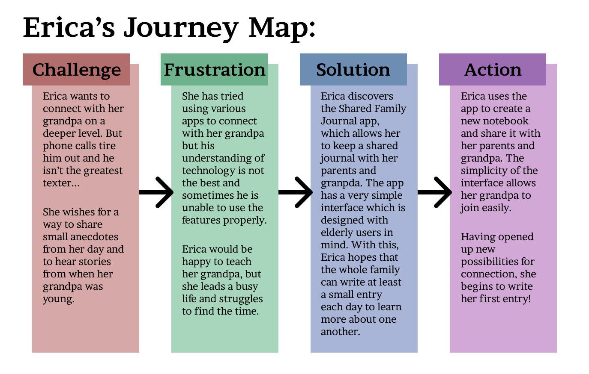
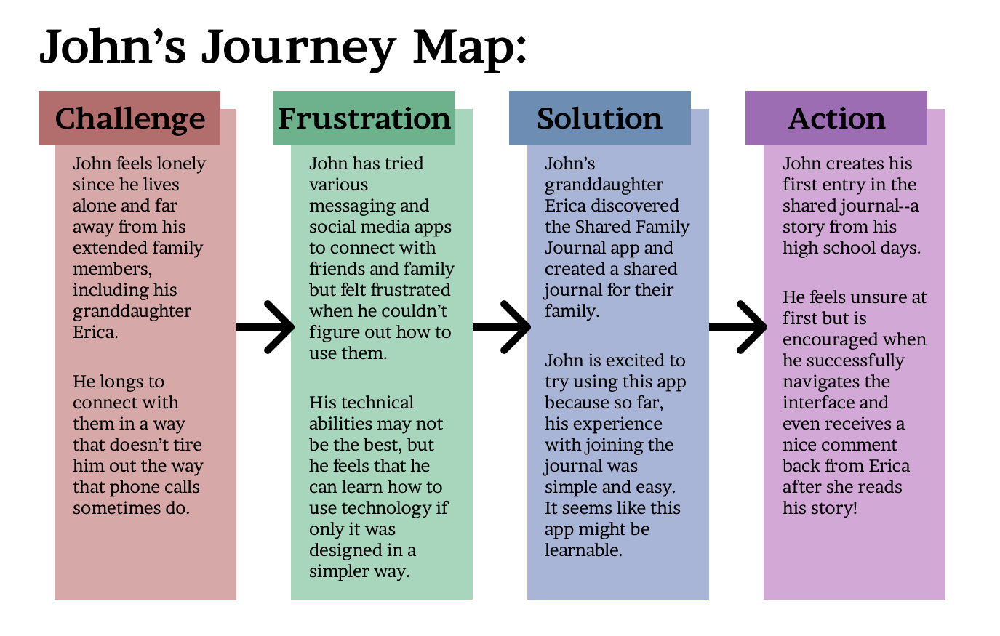

# **Assignment 4: Personas + Scenarios**
Eric Chen | DH110 | Spring 2023

## **Introduction -- UX Storytelling:**
In this assignment, I create two *personas*--fictional characters that represent target users of my shared family journal app. This is one aspect of *UX Storytelling*, in which designers attempt to deeply empathize with users. The idea is that digital experiences should be designed from the perspective of the user first and foremost. Having a single persona in mind helps the designer to imagine an actual person who might be affected by this app.  

Note: In the previous assignments, I found that existing shared journal tools lack the ease-of-use that might be needed for an elderly grandparent. This finding influenced the personas I developed in this assignment.

## **Personas:**

  

  

---

  

  

## **Scenarios:**
### Scenario #1
#### Intention & Goal (WHY):
It's a Sunday afternoon and Erica and her parents just finished their weekly phone call with Erica's grandpa John. During the phone call, they told John about Erica's recent skateboarding competition, her parents' new car, and the unseasonably hot weather in San Diego this week. Grandpa John told them about the new book he's reading and the soccer games he's been watching. It was a good call and it left Erica feeling cheerful.  

At the same time, a part of her wishes that they could have talked a little longer. She wishes she could have told her grandpa more about her friends at school and how she's been excited about her upcoming science project. She also wishes her grandpa could have told her one of his awesome stories from when he was younger, which never fail to bring her joy and make her laugh. But she knows that phone calls are tiring for her grandpa, so she doesn't want to exhaust him by talking too long. She wishes that there were some way to connect on a deeper level and at a more laid-back pace. She also thinks it would be great to learn more about what her parents do each day and what their lives were like in the past.

#### Action (HOW):
Erica taps on the icon for the new Shared Family Journal app she downloaded on her iPhone. The home interface of the app appears onscreen, displaying text that reads *"Erica's Journals"* with a large plus sign encased in a rectangle in the middle of the screen indicating that she has not created any journals yet. There is text directly above the plus sign that says *"Create New Journal."* She taps the large plus sign and is happy to find that she is immediately presented with a simple interface allowing her to enter the details of her new journal. In the box labeled *"Title"* she enters the title of her new journal: *"Family Anecdotes and Memories"* since she wants to be able to share both small moments and longer stories from the past back and forth with her grandpa and parents. There is another text box labelled *"Description"* into which she types "this journal is for me to connect with my parents and grandpa by sharing stories!". Finally, there is a heading labelled *"Share"* and a text box underneath which is filled with placeholder text that says *"enter email address or phone number..."*. Erica knows that her grandpa is more familiar with using his email than his phone so she types her grandpa's email address into the box and presses enter.  

The email address populates into a list above the text box. Then, Erica enters her parents’ phone numbers into the text box one by one and presses enter. Erica also notices a text box in the *”Share”* section labelled *”send custom message”*. She wants to write a message to her grandpa here but she is initially concerned that her grandpa might find the message confusing if it originates from an email address besides her own. She decides to try it out, typing a message to her grandpa in which she briefly explains the Shared Family Journal app and how she hopes to use it together. Finally, she clicks the large blue button at the bottom of the screen labeled *”create and share”*. She is satisfied to see the original home page again but this time there is a large book icon labelled *“Family Anecdotes and Memories”* in the middle of the screen, with the plus icon off to the right side.

Later that day, Erica talks with her parents and encourages them to join the shared journal using the share link she sent to their phones. She also sends a follow-up email to her grandpa. Within an hour, Erica is pleasantly surprised to see that her grandpa was able to successfully join the journal using the invite link she sent via email. At the end of a long day, she opens up the app, taps on the book labelled *“Family Anecdotes and Memories”* and is greeted with a large *“Create New Entry”* button. She clicks this button and prepares to write, satisfied and hopeful about this new way of connecting deeply with her family.

  

### Scenario #2
#### Intention & Goal (WHY):
It's Monday morning and John is just starting his day with some breakfast. He sits down at the table in his kitchen to eat, reading the newspaper as he does so. When he's done reading and eating, he just sits, feeling a little bit lonely. It's hard for him living alone and finding ways to occupy himself each day. He always looks forward to talking with his son, daughter-in-law, and granddaughter Erica when he gets the chance, but those phone calls usually happen only once or twice a week. And as much as he loves talking with them, speaking and straining to listen through the phone for too long really tires him out. He thinks of calling his friend that lives nearby, but stops when he realizes he really wants to interact with his family right now. Feeling sad that family is so far away, he thinks about what he can do. That's when he remembers the journaling app that his granddaughter Erica shared with him yesterday. He joined Erica's shared journal but he hasn't tried writing in it yet. He feels excited to try using the app to interact with Erica and her parents. He feels a little bit nervous that he may not be able to figure out how to use it, but decides to give it a try.

#### Action (HOW):
John pulls out his iPhone and taps on the Shared Family Journal app icon. He is immediately shown a screen with a large book icon that is labelled *"Family Anecdotes and Memories"*. John happily recognizes that this is the journal Erica shared with him yesterday. She told him that the whole family will be able to write in this journal, and read one another’s entries. He tries tapping on the large book icon, feeling unsure. He is happily surprised to see that this brings him to a new interface where the top heading says *”Family Anecdotes and Memories”* and underneath there is an empty white area that says *”no entries yet”*. Below this, there is a large blue button that says *“Create New Entry”*. John notices and appreciates that all the on-screen text is very large, which makes it easier on his eyes. He clicks the new entry button and is brought to another simple screen. There is a smaller text box at the top of the page that says *“Entry Title”* and a larger box filling the screen below that’s labelled *“write your journal entry here”*. John thinks for a moment about what he wants to write about in his first entry. He decides to tell his family about a funny story about the horrible cafeteria lunch at his high school many years ago. He clicks the title text box and types *“Gross cafeteria food”*. Then he clicks the main text box below and starts typing his story. It takes him a while to type on his phone but that doesn’t bother him too much, since he has plenty of time on his hands. After about 30 minutes of typing the story, John feels satisfied with his entry and eager to share it with his family. He notices a large “Submit Entry” button at the top right of the screen. When he taps it, a message appears, saying *“are you ready to submit this entry to the journal?”* with options *“Yes”* and *“No”* as possible choices. John taps *”Yes”*, and immediately sees the journal screen from before but this time there is a single bar on the page with today’s date and the title *”Gross cafeteria food“*. John feels pleased to have successfully posted his story, but he can’t be completely sure until he knows that his family was able to read it.

About 30 minutes later, John receives a notification on his phone that Erica liked his new entry. He re-opens the app to the journal page and sees a new bubble next to his entry that says *”new comments”*. He taps on his entry and is taken to a screen where he can read his entire story. He also notices that when he scrolls down to the end of this story, there is a new section labelled *“comments”* with a box containing a comment from Erica, who apparently got a good laugh out of his story. John smiles, feeling happy and excited to read new entries from his family members when they write their own stories in the journal.

  

## **Reflection:**
Creating personas and imagining them accomplishing goals within certain scenarios was surprisingly enjoyable. The idea of empathizing with the user seems like a great starting point for developing technology that benefits people's wellbeing. I think this strategy should be applied more extensively in the tech world. For example, I think social media apps should focus on really empathizing with a persona in order to deeply understand how a product might affect users both positively and negatively.
