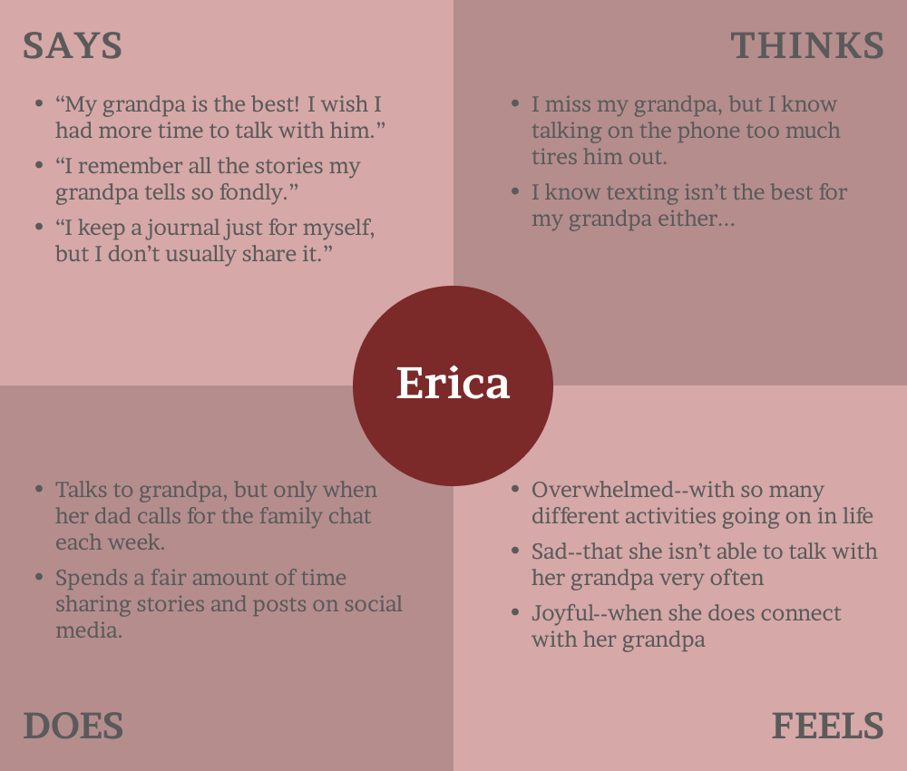

# **Assignment 4: Persona + Scenario**
Eric Chen | DH110 | Spring 2023

## **Introduction -- UX Storytelling:**
In this assignment, I create two *personas*--fictional characters that represent target users of my shared family journal app. This is one aspect of *UX Storytelling*, in which designers attempt to deeply empathize with users. The idea is that digital experiences should be designed from the perspective of the user first and foremost. Having a single persona in mind helps the designer to imagine an actual person who might be affected by this app.  

## **Note:**
In the previous assignments, I found that existing shared journal tools lack the ease-of-use that might be needed for an elderly grandparent. This finding influenced the personas I developed in this assignment.

## **Personas:**

  

  

---

  

  

## **Scenarios:**
### Scenario 1
You need to break down each interaction step, vividly describe what kind of information is provided, what kind of interface was provided (ex. Button labeled “post”), and what the persona perceived, understood, and took an action (ex. Press the button labed “post”). Then, what happens after the persona’s action (ex. System feedback) and how the persona evaluated the action taken (ex. happy to find it successful, or frustrated to find it unsuccessful).

### Scenario 2

## **Reflection:**
