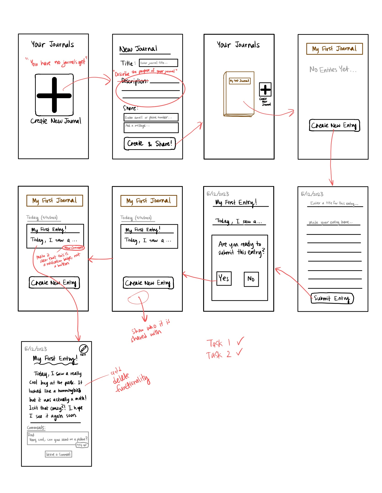

# **Assignment 5: Low-Fi Prototype**
Eric Chen | DH110 | Spring 2023

## **Project Description:**
In the previous assignment, I created two *personas*--fictional characters that represent target users of my shared family journal app. My personas were a high schooler and her grandfather, and I described how they created a shared journal together and wrote new entries to connect with one another. In this assignment, I will condense these user stories into a low-fidelity prototype of the shared family journal app I am designing. I will show the basic features of each screen that is involved in the completion of the following two tasks:  

1. Creating and Sharing a New Journal
2. Adding an Entry and Reading New Comments

## **Intial Wireframes:**

  

These were the intial screens that I designed for my app. After I started to create the wireflow, I realized that certain functionality was missing. For example, there were no back buttons to return home to the "Your Journals" page. Also, I didn't include an option to quit writing an entry and save it as a draft for later. These issues only came to my attention once I started to draw arrows between screens to illustrate the flow, and realized that I had limited the user's freedom. In the wireflow that follows, I added in these missing functionalities.

## **Wireflow:**

  

## **Testing:**
I tested my wireflow by asking my friend to try to accompish the two tasks by looking at a version of the wireflow without the arrows. My friend told me where they wanted to click and which screen they think this would lead them to. I corrected them when necessary, and noted the issues and points of confusion.

  

  

  

## **Reflection:**
Initially I expected to create my wireframes on Figma. However, the process of sketching them out by hand instead was surprisingly useful, because it encouraged me to focus on the functionality rather than the look and feel of each screen.  

For the testing process, I thought it went relatively smoothly and I received a lot of useful feedback.  

Here are the top points that I took away from the testing session:
- One
- Two
- Three

