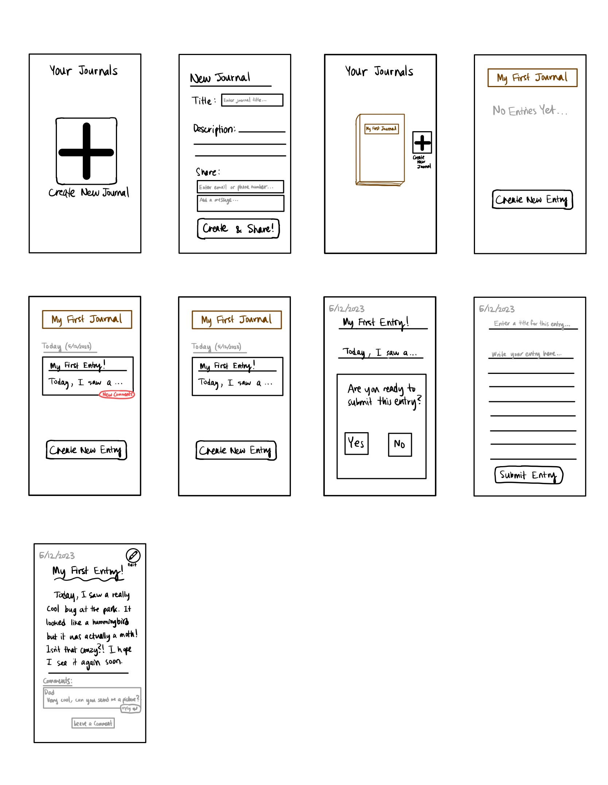
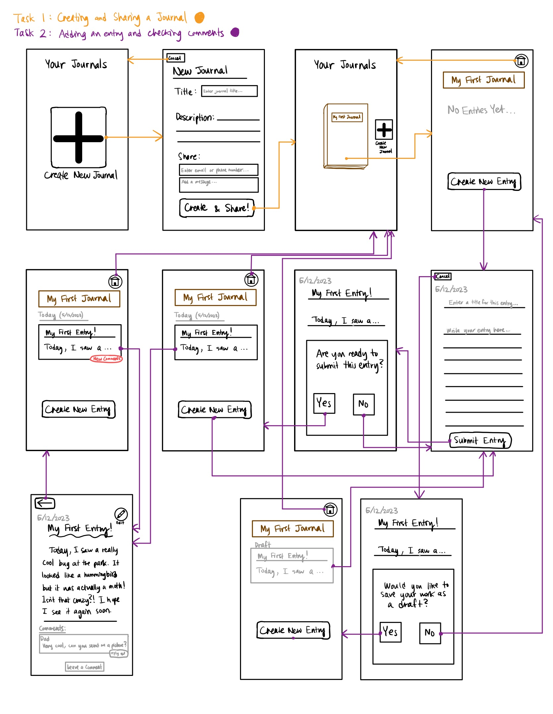

# **Assignment 5: Low-Fi Prototype**
Eric Chen | DH110 | Spring 2023

## **Project Description:**
In this assignment, I create two *personas*--fictional characters that represent target users of my shared family journal app. This is one aspect of *UX Storytelling*, in which designers attempt to deeply empathize with users. The idea is that digital experiences should be designed from the perspective of the user first and foremost. Having a single persona in mind helps the designer to imagine an actual person who might be affected by this app.  

## **Tasks:**

## **Intial Wireframes:**

  

## **Wireflow:**

  

## **Testing:**

## **Reflection:**
