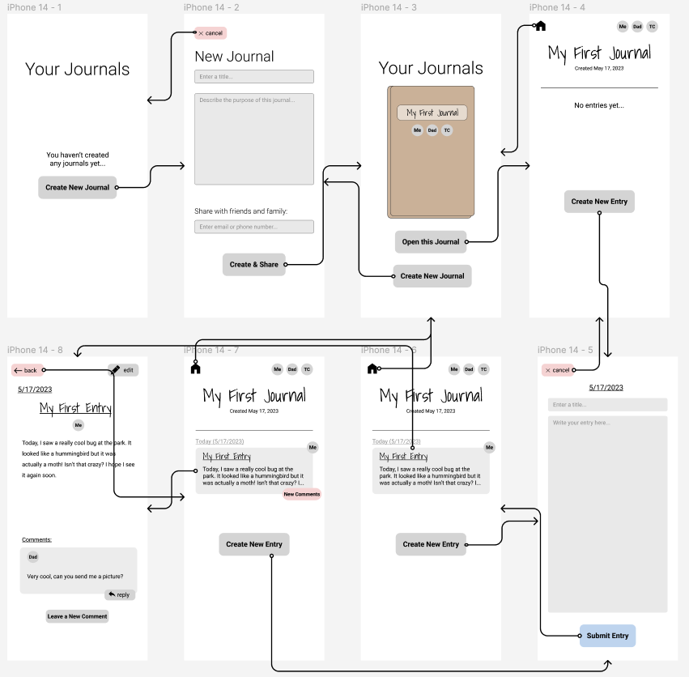
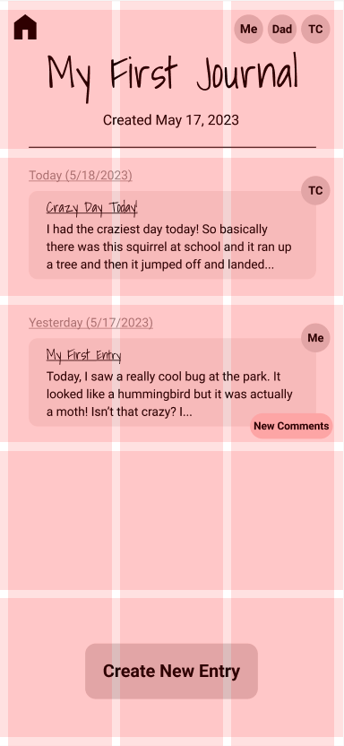
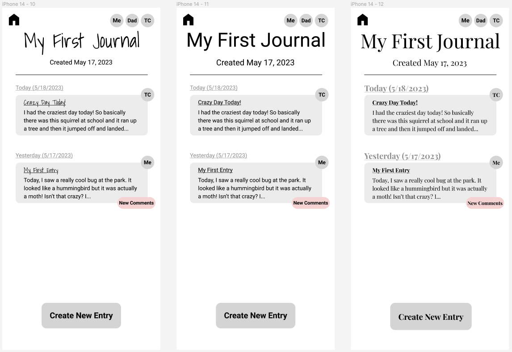
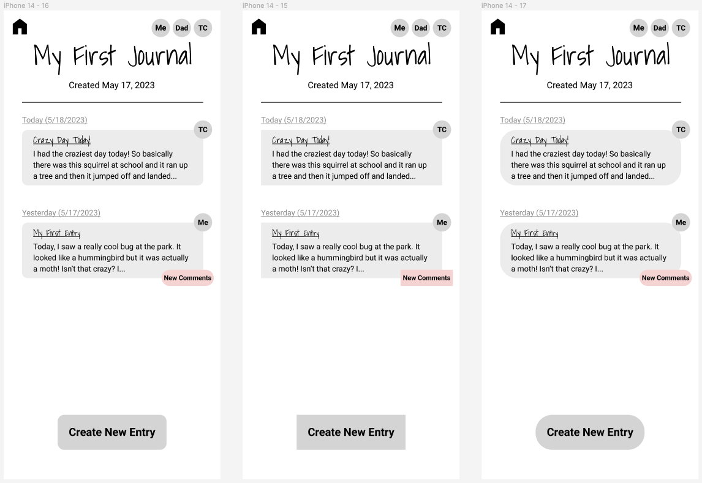
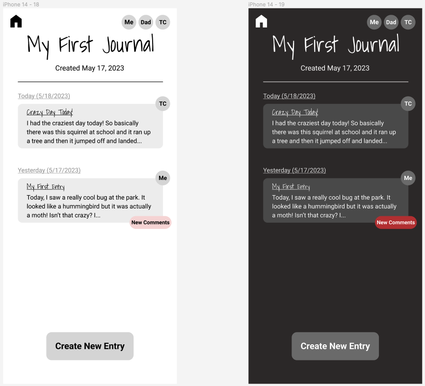
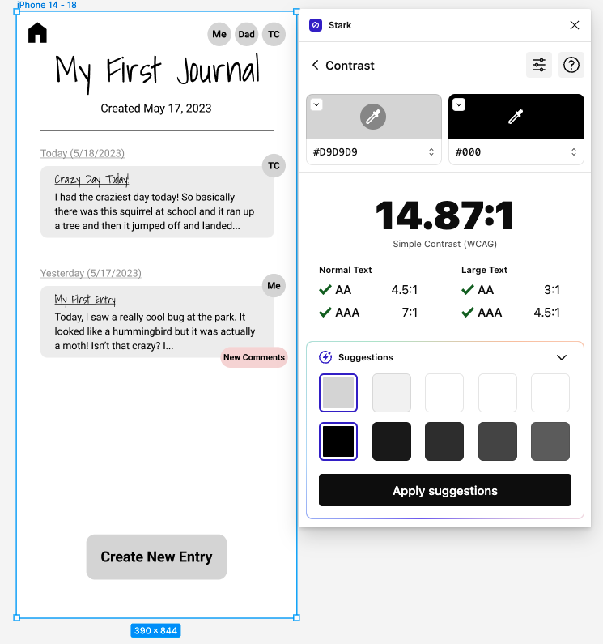
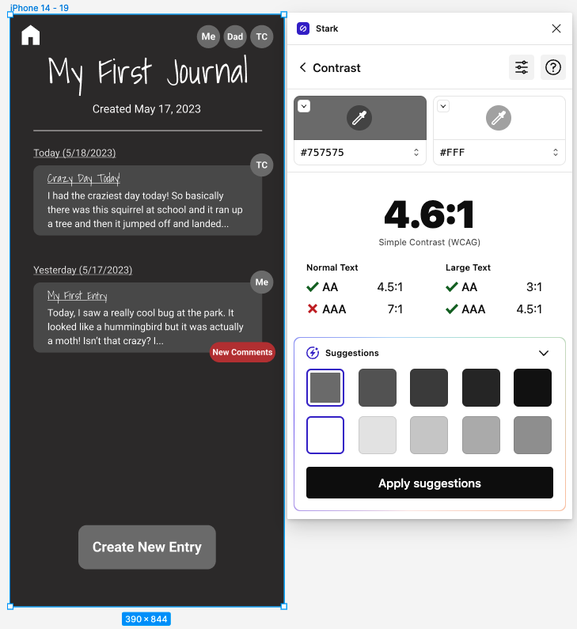

# **Assignment 6: Interface Design**
Eric Chen | DH110 | Spring 2023

## **Project Description:**
My project goal is to design a shared family journal app. I drew inspiration from the "Waffle" app, which enables shared journals but has some usability concerns. By creating personas and sample tasks, I learned that the "Waffle" app could be better suited to elderly people, which is one class of target users that I aim to cater towards. In the previous assignment, I sketched out wireframes/wireflows by hand and had a user attempt to complete tasks by navigating from screen to screen. I identified some issues with my wireframes during this process. For this assignment, I will incorporate everything I have learned about my target user and issues with my old wireframe to create a digitized wireframe in Figma, and design an effective interface for my app.

## **Digitized Wireflow [(link)](https://www.figma.com/file/PUs2v1y9W7B3x9wLBcEy9T/Wireflow?type=design&node-id=0%3A1&t=jXO7H8gpGTyPT84d-1):**
I created this wireflow by transfering my hand drawn version into Figma. I also incorporated the concerns raised through testing in the previous assignment.  

  

## **Screen Design (Layout Test):**
Next, I tested design variations for a single screen: the journal homepage which displays all the user's entries.  

For my overall layout grid, I chose to use 5 rows, 1 for the heading, 1 for the "Create New Entry" button, and 3 to display the user's journal entries. The user would be able to see more entries by scrolling, but 3 are visible without scrolling. I choose to use 3 columns. Even though most of my content is arranged vertically rather than horizontally, this helps with the placement of the home button and list of contributors at the top of the screen. I used a margin of 10px and a gutter of 10px for both columns and rows, because this gave sufficient space between elements. Here is a picture of this general layout:  

  

I grouped the entry title and content into a rounded rectangle. This aids with the user's ability to see this content as a single group (an application of Gestalt theory).

### **Typographic Variations:**
Option 1: Playful look with handwriting style font in main heading.
- Main heading: Shadows into Light, 48px
- Date: Roboto, 16px
- Entry heading: Shadows into Light, 16px
- Body text: Roboto, 14px, line-height 150%
- Button: Roboto bold, 20px
- Notification badge: Roboto bold, 12px

Option 2: Clean minimal look with only sans-serif fonts
- Main heading: Roboto, 48px
- Date: Roboto, 20px
- Body text: Roboto, 14px, line-height 150%
- Button: Roboto bold, 20px
- Notification badge: Roboto bold, 12px

Option 3: Professional/elegant look with only serif fonts
- Main heading: Playfair display, 48px
- Date: Playfair display, 20px
- Entry date: Playfair display bold, 20px
- Entry heading: Playfair display bold, 14px
- Body text: Playfair display, 14px, line-height 150%
- Button: Playfair display bold, 20px
- Notification badge: Playfair display bold, 12px

  

  

### **Shape Variations:**
Option 1: moderately rounded look  
Option 2: straight rectangular look  
Option 3: very rounded bubble look

  

  

### **Color Schemes:**
I created a light mode and a dark mode. The dark mode is essentially the light mode with colors inverted. The only difference is that I manually adjusted the red color of the "New Comments" notification badge.  

  

  

I ensured that both color schemes achieved an accessibility WCAG2.0 AA level rating using the Stark plugin in Figma.  

  
  

## **Impression Test with User:**

## **Summary of Design System:**
- Typeface family + size:
  - Main heading: Shadows into Light, 48px
  - Date: Roboto, 16px
  - Entry heading: Shadows into Light, 16px
  - Body text: Roboto, 14px, line-height 150%
  - Button: Roboto bold, 20px
  - Notification badge: Roboto bold, 12px
  - I liked the look of the handwritten journal and entry headers. While the serif font looked more professional, it also made the interface appear older and more cluttered. Therefore, I decided to use the sans-serif font for everything besides the headers.
- Moderately rounded shapes
  - I decided that the moderately rounded entry blocks and buttons made for a playful look without sacrificing professionalism. The very rounded look was less visually appealing and looked childish. My decision matches the goal of the journal, which is to be a lighthearted and fun way to connect while appearing reliable and appealing to all ages.
- Color scheme:
  - Ideally I would like to offer both a dark and a light version depending on the user's preference. I think both color schemes look visually appealing and the ability to switch between them might help ease the strain on the user's eyes.
- Layout grid + spacing: 
  - 5 rows (margin 10px, gutter 10px), 3 columns (margin 10px, gutter 10px). Content is centered in the middle of the grid blocks created by the columns and rows.  
