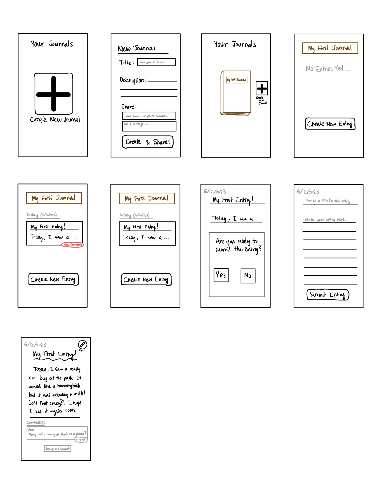
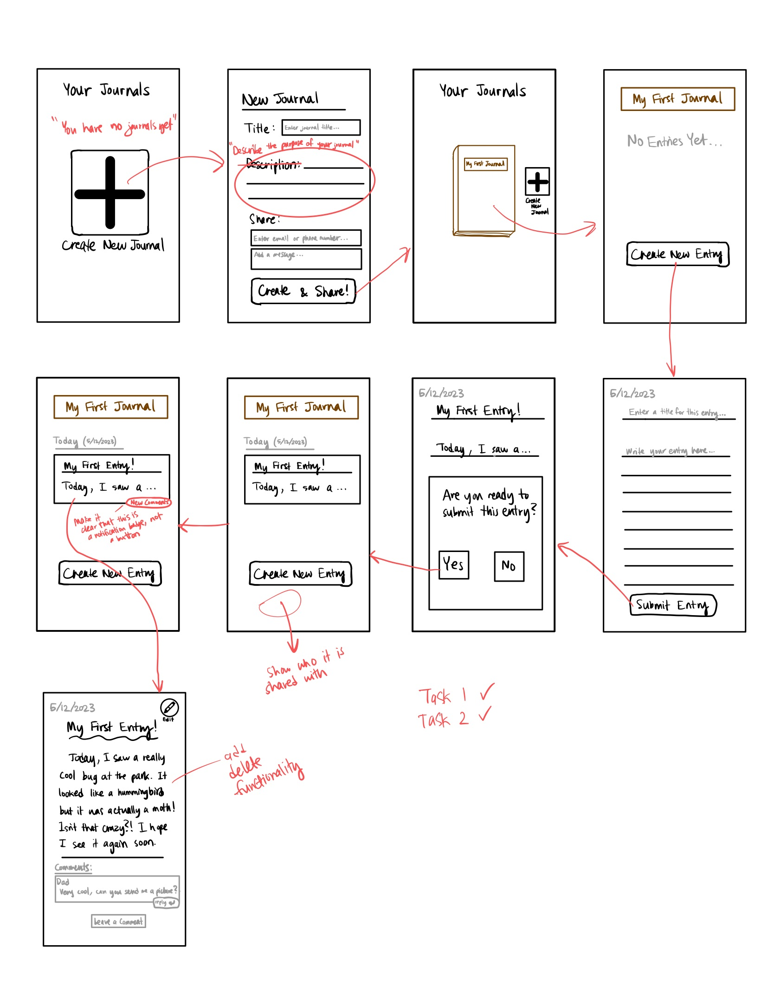

# **Assignment 6: Interface Design**
Eric Chen | DH110 | Spring 2023

## **Project Description:**

## **Digitized Wireflow:**
Description  

  

## **Screen Design:**
Next, I tested design variations for a single screen: the journal homepage which displays the user's entries.  

For my overall layout grid, I chose to use 5 rows, 1 for the heading, 1 for the "Create New Entry" button, and 3 to display the user's journal entries. The user would be able to see more entries by scrolling, but 3 would be visible without scrolling. I choose to use 3 columns. Even though most of my content is arranged vertically rather than horizontally, this helps with the placement of the home button and list of contributors at the top of the screen. I used a margin of 10px and a gutter of 10px for both columns and rows, because this gave sufficient space between elements. Here is a picture of this general layout:  

  

As you can see, I grouped the entry title and content into a rounded rectangle. This aids with the user's ability to see this content as a single group (an application of Gestalt theory).

### **Typographic Variations:**
Option 1: Playful look with handwriting style font in main heading.
- Main heading: Shadows into Light, 48px
- Date: Roboto, 16px
- Entry heading: Shadows into Light, 16px
- Body text: Roboto, 14px, line-height 150%
- Button: Roboto bold, 20px
- Notification badge: Roboto bold, 12px

Option 2: Clean minimal look with only sans-serif fonts
- Main heading: Roboto, 48px
- Date: Roboto, 20px
- Body text: Roboto, 14px, line-height 150%
- Button: Roboto bold, 20px
- Notification badge: Roboto bold, 12px

Option 3: Professional/elegant look with only serif fonts
- Main heading: Playfair display, 48px
- Date: Playfair display, 20px
- Entry date: Playfair display bold, 20px
- Entry heading: Playfair display bold, 14px
- Body text: Playfair display, 14px, line-height 150%
- Button: Playfair display bold, 20px
- Notification badge: Playfair display bold, 12px

  

  

### **Shape Variations:**

### **Color Schemes:**

### **Layout Test:**

## **Impression Test with User:**

## **Accessibility Test:**

## **Summary of Design System:**
- Typeface family + size: 
- Color scheme: 
- Layout grid + spacing: 

  

  

  

## **Reflection:**
Initially I expected to create my wireframes on Figma. However, the process of sketching them out by hand instead was surprisingly useful, because it encouraged me to focus on the functionality rather than the look and feel of each screen.  

For the testing process, I thought it went relatively smoothly and I received a lot of useful feedback. For the most part, my user was able to navigate the tasks with ease, but there were a few small points where she had trouble or requested clarification.  

Here are the top points that I took away from the testing session:
- When the user first starts, the homescreen of the app should be more explicit in alerting the user that they have no journals yet.
- In the "New Journal" screen, the box that says "Description" should probably say something more explicit like "Describe the purpose of your journal." The reason for this is that my test user initially thought that this was the place to write an entire journal entry.
- On the main screen of a journal that displays all the entries, it should also show the user who it is shared with.
- The "New Comment" notification should be more clearly identifiable as a notification badge rather than a button.
- There should be a "Delete" button for an entry that you want to dispose of.

The main theme of the feedback I received was to make instructions to the user more explicit and to display more information. This reminds me of the heuristsic of "recognition over recall," and I think I can use this principal to improve the functionalities that I make available on my app.
