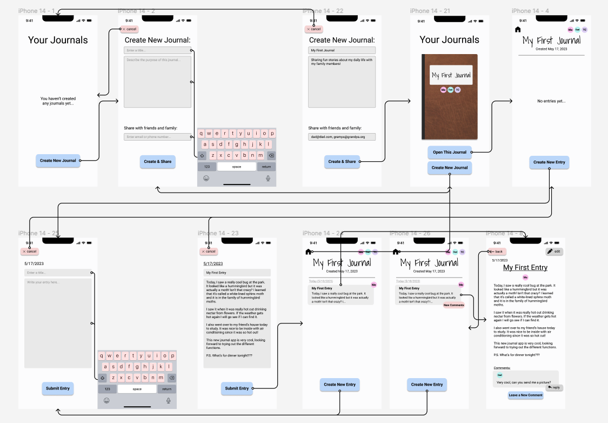

# **Assignment 7: Hi-Fi Prototype**
Eric Chen | DH110 | Spring 2023

## **Project Description:**
The goal of my project is to create a shared family journaling app. For this assignment, I converted my low-fidelity wireflow into an interactive, high-fidelity prototype with my interface design chioces incorporated in. One purpose of this phase is to allow better usability testing. While my initial test of my wireflow was useful, it was difficult to draw conclusions from it since the user was interacting in a very artificial way by pointing at a piece of paper instead of actually using a screen. Additionally, this prototype will help me identify interactivity issues that I wouldn't otherwise think about.

## **Tasks:**
I have been creating wireflows and prototypes around two main user tasks:
1. Creating a new journal and sharing it with friends and family
2. Writing a new entry and submitting it to the journal

Since these tasks are relatively easy, I also added another small task: receiving a new comment and reading it. These tasks have been the central focus of the user-centered design process.

## **Interactive Prototype:**
Here is the link to my interactive prototype made with Figma:
[Click Here](https://www.figma.com/proto/PUs2v1y9W7B3x9wLBcEy9T/Shared-Family-Journal-Wireflow-%26-Interface-Design?type=design&node-id=42-135&scaling=scale-down&page-id=42%3A134&starting-point-node-id=42%3A135)

## **Wireflow with Interface Design:**
I also revised my wireflow from the previous assignments by implementing my interface design system. This is the new wireflow:

  

## **Cognitive Walkthrough:**
