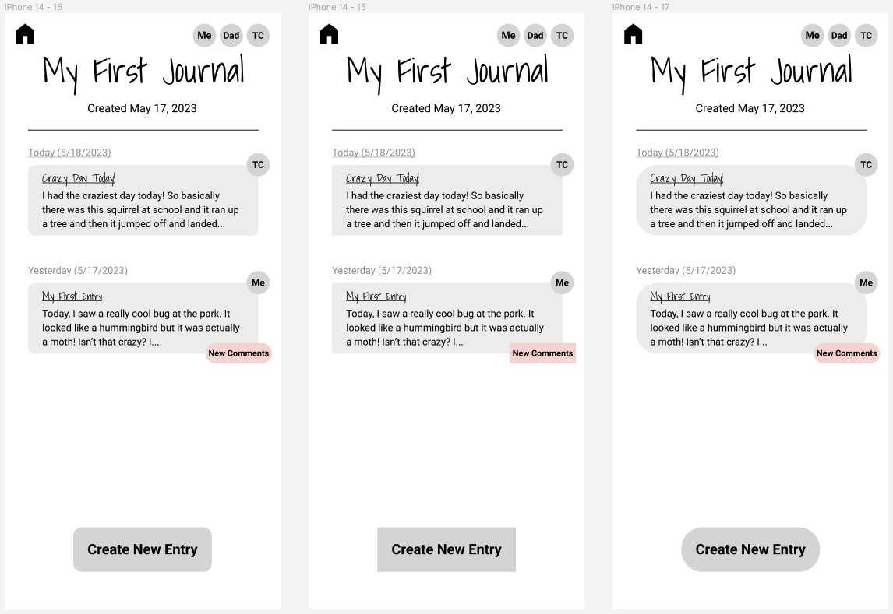
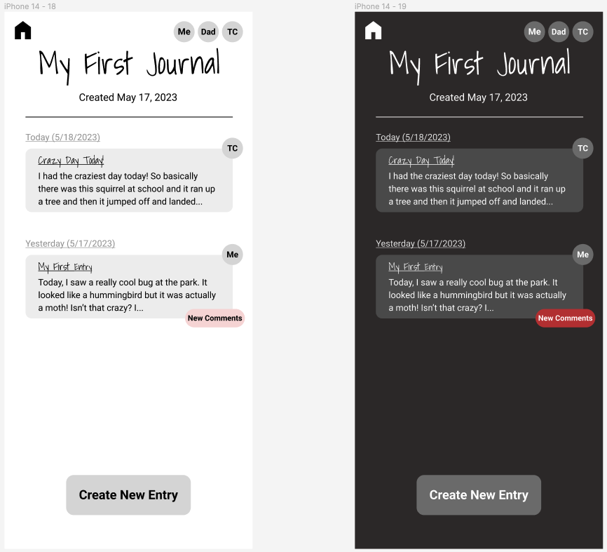

# **Assignment 7: Hi-Fi Prototype**
Eric Chen | DH110 | Spring 2023

## **Project Description:**
The goal of my project is to create a shared family journaling app. For this assignment, I converted my low-fidelity wireflow into an interactive, high-fidelity prototype with my interface design chioces incorporated in. One purpose of this phase is to allow better usability testing. While my initial test of my wireflow was useful, it was difficult to draw conclusions from it since the user was interacting in a very artificial way by pointing at a piece of paper instead of actually using a screen. Additionally, this prototype will help me identify interactivity issues that I wouldn't otherwise think about.

## **Tasks:**
I have been creating wireflows and prototypes with 2 main tasks in mind:
1. Creating a new journal and sharing it with friends and family
2. Writing a new entry and submitting it to the journal

Since these tasks are relatively easy, I also added another small task: receiving a new comment and reading it.

## **Interactive Prototype:**
Here is the link to my interactive prototype made with Figma:
[Click Here](https://www.figma.com/proto/PUs2v1y9W7B3x9wLBcEy9T/Shared-Family-Journal-Wireflow-%26-Interface-Design?type=design&node-id=42-135&scaling=scale-down&page-id=42%3A134&starting-point-node-id=42%3A135)

## **Wireflow with Interface Design:**

## **Cognitive Walkthrough:**

## **Digitized Wireflow [(link)](https://www.figma.com/file/PUs2v1y9W7B3x9wLBcEy9T/Shared-Family-Journal-Wireflow-%26-Interface-Design?type=design&node-id=0%3A1&t=lCbSrSJrwexBj1Yo-1):**
I created this wireflow by transfering my hand drawn version into Figma. I also incorporated the concerns raised through testing in the previous assignment.  

  

## **Screen Design:**
Next, I tested design variations for a single screen: the journal homepage which displays all the user's entries.  

### **Layout:**
For my overall layout grid, I chose to use 5 rows, 1 for the heading, 1 for the "Create New Entry" button, and 3 to display the user's journal entries. The user would be able to see more entries by scrolling, but 3 are visible without scrolling. I choose to use 3 columns. Even though most of my content is arranged vertically rather than horizontally, this helps with the placement of the home button and list of contributors at the top of the screen. I used a margin of 10px and a gutter of 10px for both columns and rows, because this gave sufficient space between elements. Here is a picture of this general layout:  

  

I grouped the entry title and content into a rounded rectangle. This aids with the user's ability to see this content as a single group (an application of Gestalt theory).

### **Typographic Variations:**
Option 1: Playful look with handwriting style font in main heading.
- Main heading: Shadows into Light, 48px
- Date: Roboto, 16px
- Entry heading: Shadows into Light, 16px
- Body text: Roboto, 14px, line-height 150%
- Button: Roboto bold, 20px
- Notification badge: Roboto bold, 12px

Option 2: Clean minimal look with only sans-serif fonts
- Main heading: Roboto, 48px
- Date: Roboto, 20px
- Body text: Roboto, 14px, line-height 150%
- Button: Roboto bold, 20px
- Notification badge: Roboto bold, 12px

Option 3: Professional/elegant look with only serif fonts
- Main heading: Playfair display, 48px
- Date: Playfair display, 20px
- Entry date: Playfair display bold, 20px
- Entry heading: Playfair display bold, 14px
- Body text: Playfair display, 14px, line-height 150%
- Button: Playfair display bold, 20px
- Notification badge: Playfair display bold, 12px

  

  

### **Shape Variations:**
Option 1: moderately rounded look  
Option 2: straight rectangular look  
Option 3: very rounded bubble look

  

  

### **Color Schemes:**
I created a light mode and a dark mode. The dark mode is essentially the light mode with colors inverted. The only difference is that I manually adjusted the red color of the "New Comments" notification badge.  

  

  

I ensured that both color schemes achieved an accessibility WCAG2.0 AA level rating using the Stark plugin in Figma.  

  
  

## **Impression Test with User:**
I showed my interface design to my friend Matt and asked him for his impressions. I encouraged him to share whatever came to mind. Here are some quotes:  
- "I'm wondering what TC stands for." (TC was supposed to be the initials of another user that the journal is shared with. I will consider ways to make this more clear.)
- "The font of the underlined titles isn't my favorite."
- "Adding more color would make it more fun but maybe less professional."  
- "It looks like there should be something here (he pointed to the space between the last entry and the create new entry button)."

Some key points were:
- Matt thought it looked professional
- He also thought the handwriting-style font was "fun," but he didn't love it. He didn't realize that the main heading font and entry heading fonts were the same, and he only had an issue with the smaller entry heading. So I will change the entry heading font to sans-serif while leaving the main heading the same based off of his feedback.
- I will also add colors, but not so much that it loses its professional look. Specifically, I will add colors to the user initial bubbles.
- I will place the add new entry button right after the last entry, instead of always putting it at the very bottom of the screen. If there are 3 or more entries then the button will be placed at the bottom of the screen as before.

## **Summary of Design System:**
After considering my design variations and the feedback from the impression test, here is the final design system I settled on:
- Typeface family + size:
  - Main heading: Shadows into Light, 48px
  - Date: Roboto, 16px
  - Entry heading: Roboto bold, 16px
  - Body text: Roboto, 14px, line-height 150%
  - Button: Roboto bold, 20px
  - Notification badge: Roboto bold, 12px
  - I liked the look of the handwritten journal headers. I removed the handwritten entry headers after the feedback from the impression test. While the serif font looked more professional, it also made the interface appear older and more cluttered. Therefore, I decided to use the sans-serif font for everything besides the headers.
- Moderately rounded shapes
  - I decided that the moderately rounded entry blocks and buttons made for a playful look without sacrificing professionalism. The very rounded look was less visually appealing and looked childish. My decision is motivated by the goal of the journal, which is to be a lighthearted and fun way to connect while appearing reliable and appealing to all ages.
- Color scheme:
  - Ideally I would like to offer both a dark and a light version depending on the user's preference. I think both color schemes look visually appealing and the ability to switch between them might help ease the strain on the user's eyes.
- Layout grid + spacing: 
  - 5 rows (margin 10px, gutter 10px), 3 columns (margin 10px, gutter 10px). Content is centered in the middle of the grid blocks created by the columns and rows. If there are less than 3 entries, the create new entry button is placed in the grid block right after the last entry. Otherwise, it goes in the last grid block at the bottom of the screen.

Here is an image of the journal homescreen implementing this design system:

  

